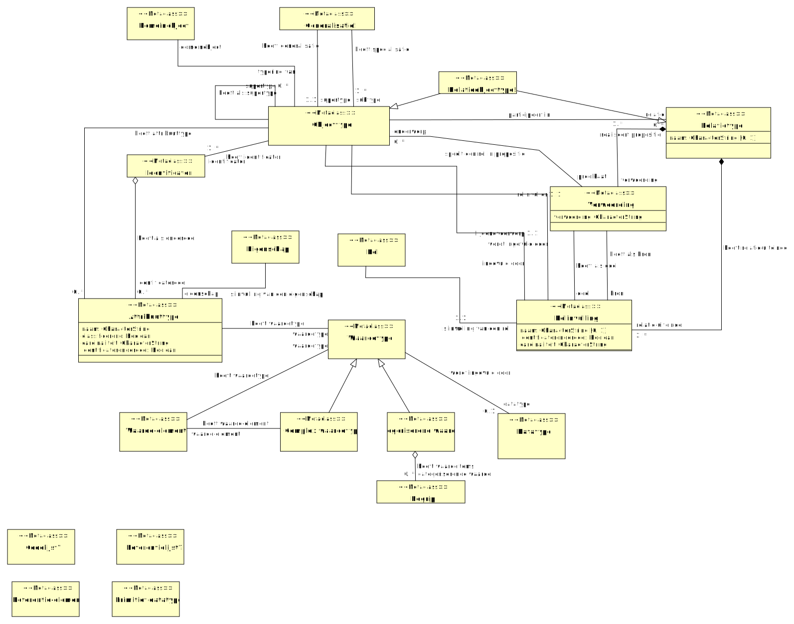

## Domein MIM-Metaklassen-CIM-Logisch

### LGM-CIM-MIM - detail

## Objecttypes en relatieklassen

### Attribuuttype {#5322E10D-149C-47b9-8FB8-0DE0A2E14291}

Een attribuuttype is een typering van een [kenmerk], behorende tot een [objecttype] of [relatietype]

|{: .def}||
|-|-|
|Naam|Attribuuttype|
|Indicatie abstract object|Nee|
|Definitie|Een attribuuttype is een typering van een [kenmerk], behorende tot een [objecttype] of [relatietype]|

|Attribuut|Definitie|Formaat|Card|
|---------|---------|-------|----|
|naam||[CharacterString]()|1..1|
|classificerend|niet in objecttypen uitgewerkte subtypering|[Boolean]()|1..1|
|cardinaliteit||[CharacterString]()|1..1|
|identificatoronderdeel|Een identificerend kenmerk is een [kenmerk] waarmee de identiteit van een [domeinobject] mede kan worden vastgesteld|[Boolean]()|1..1|

|Relatie|Definitie
|-------|---------|
|[Attribuuttype](#5322E10D-149C-47b9-8FB8-0DE0A2E14291) heeft waardetype waardetype [Waardetype](#3E4E758C-8DD4-4e31-9643-2ED6926EA4B0) []||
|[Objecttype](#A80A4669-D70D-42cd-9E1D-856E1DFF20F6) heeft attribuuttype  [Attribuuttype](#5322E10D-149C-47b9-8FB8-0DE0A2E14291) [0..*]||
|[Identificator](#CEB3BBDF-F417-4069-B2F2-48229021C53A) heeft als onderdeel identificatordeel [Attribuuttype](#5322E10D-149C-47b9-8FB8-0DE0A2E14291) [0..*]||
|[Attribuuttype](#5322E10D-149C-47b9-8FB8-0DE0A2E14291) is invulling van een eigenschap eigenschap [Eigenschap](#CADD3F4F-2B35-40ac-A85D-C54B59DEF9BB) []||

### Begrip {#A2948621-8D54-4c64-B640-3FFB3D223CE6}

|{: .def}||
|-|-|
|Naam|Begrip|
|Indicatie abstract object|Nee|

|Relatie|Definitie
|-------|---------|
|[Categoriserend waardetype!](#924567F9-2141-4876-9AF5-7E4796E0A845) heeft waardeitems categoriserende waarde [Begrip](#A2948621-8D54-4c64-B640-3FFB3D223CE6) [0..*]||
|[Begrip](#A2948621-8D54-4c64-B640-3FFB3D223CE6) verwoording van een categorie   [1..*]||

### Categoriserend waardetype! {#924567F9-2141-4876-9AF5-7E4796E0A845}

dit is een waardelijst

|{: .def}||
|-|-|
|Naam|Categoriserend waardetype!|
|Indicatie abstract object|Nee|
|Definitie|dit is een waardelijst|

|Relatie|Definitie
|-------|---------|
|[Categoriserend waardetype!](#924567F9-2141-4876-9AF5-7E4796E0A845) is specialisatie van [Waardetype](#3E4E758C-8DD4-4e31-9643-2ED6926EA4B0)||
|[Categoriserend waardetype!](#924567F9-2141-4876-9AF5-7E4796E0A845) heeft waardeitems categoriserende waarde [Begrip](#A2948621-8D54-4c64-B640-3FFB3D223CE6) [0..*]||

### Codelijst? {#750E98C4-255B-4b0f-AA70-B25C6242EA6A}

|{: .def}||
|-|-|
|Naam|Codelijst?|
|Indicatie abstract object|Nee|

### Complex waardetype {#AF02163D-EA42-4739-A134-E9E43DA37E67}

Een complex waardetype is een typering van gelijksoortige [complexe waarden]

|{: .def}||
|-|-|
|Naam|Complex waardetype|
|Indicatie abstract object|Nee|
|Definitie|Een complex waardetype is een typering van gelijksoortige [complexe waarden]|

|Relatie|Definitie
|-------|---------|
|[Complex waardetype](#AF02163D-EA42-4739-A134-E9E43DA37E67) heeft waarde-element waarde-element [Waarde-element!](#3C6F95C0-D3C4-4429-82D5-F139299A38CF) []||
|[Complex waardetype](#AF02163D-EA42-4739-A134-E9E43DA37E67) is specialisatie van [Waardetype](#3E4E758C-8DD4-4e31-9643-2ED6926EA4B0)||

### Generalisatie! {#554D263F-A396-4c24-9767-BD58B14B7B97}

|{: .def}||
|-|-|
|Naam|Generalisatie!|
|Indicatie abstract object|Nee|

|Relatie|Definitie
|-------|---------|
|[Generalisatie!](#554D263F-A396-4c24-9767-BD58B14B7B97) heeft specialisatie subtype [Objecttype](#A80A4669-D70D-42cd-9E1D-856E1DFF20F6) [1..*]||
|[Generalisatie!](#554D263F-A396-4c24-9767-BD58B14B7B97) heeft generalisatie supertype [Objecttype](#A80A4669-D70D-42cd-9E1D-856E1DFF20F6) [1..1]||

### Identificator {#CEB3BBDF-F417-4069-B2F2-48229021C53A}

Een identificator is een geheel van één of meerdere [identificerende kenmerken] waarmee de identiteit van een [domeinobject] uniek kan worden vastgesteld

|{: .def}||
|-|-|
|Naam|Identificator|
|Indicatie abstract object|Nee|
|Definitie|Een identificator is een geheel van één of meerdere [identificerende kenmerken] waarmee de identiteit van een [domeinobject] uniek kan worden vastgesteld|

|Relatie|Definitie
|-------|---------|
|[Objecttype](#A80A4669-D70D-42cd-9E1D-856E1DFF20F6) heeft identificator identificator [Identificator](#CEB3BBDF-F417-4069-B2F2-48229021C53A) [1..*]||
|[Identificator](#CEB3BBDF-F417-4069-B2F2-48229021C53A) heeft als onderdeel identificatordeel [Attribuuttype](#5322E10D-149C-47b9-8FB8-0DE0A2E14291) [0..*]||

### Objecttype {#A80A4669-D70D-42cd-9E1D-856E1DFF20F6}

Een objecttype is een typering van gelijksoortige [domeinobjecten]

|{: .def}||
|-|-|
|Naam|Objecttype|
|Indicatie abstract object|Nee|
|Definitie|Een objecttype is een typering van gelijksoortige [domeinobjecten]|

|Relatie|Definitie
|-------|---------|
|[Rolinvulling](#C11E0907-9B14-4123-9A26-4F54539FBFEB) ingevuld door lijdendvoorwerp [Objecttype](#A80A4669-D70D-42cd-9E1D-856E1DFF20F6) [1..1]||
|[Objecttype](#A80A4669-D70D-42cd-9E1D-856E1DFF20F6) heeft als supertype supertype [Objecttype](#A80A4669-D70D-42cd-9E1D-856E1DFF20F6) [0..*]||
|[Rolinvulling](#C11E0907-9B14-4123-9A26-4F54539FBFEB) wordt ingevuld door rolinvuller [Objecttype](#A80A4669-D70D-42cd-9E1D-856E1DFF20F6) [1..1]||
|[Generalisatie!](#554D263F-A396-4c24-9767-BD58B14B7B97) heeft specialisatie subtype [Objecttype](#A80A4669-D70D-42cd-9E1D-856E1DFF20F6) [1..*]||
|[Objecttype](#A80A4669-D70D-42cd-9E1D-856E1DFF20F6) heeft attribuuttype  [Attribuuttype](#5322E10D-149C-47b9-8FB8-0DE0A2E14291) [0..*]||
|[Objecttype](#A80A4669-D70D-42cd-9E1D-856E1DFF20F6) heeft identificator identificator [Identificator](#CEB3BBDF-F417-4069-B2F2-48229021C53A) [1..*]||
|[Objecttype](#A80A4669-D70D-42cd-9E1D-856E1DFF20F6) speelt een rol in propositie predikaat [Verwoording](#6A085917-90D7-404a-BE30-B1A1DDFAD644) [0..*]||
|[Generalisatie!](#554D263F-A396-4c24-9767-BD58B14B7B97) heeft generalisatie supertype [Objecttype](#A80A4669-D70D-42cd-9E1D-856E1DFF20F6) [1..1]||
|[Objecttype](#A80A4669-D70D-42cd-9E1D-856E1DFF20F6) participeert in relatie [Relatietype](#771B0E96-D69D-4f75-B1CC-F44F721ABCAA) [0..*]||
|[Relatieobjecttype!](#51C29EE0-468B-4a10-A9D8-52FD427FCFC1) is specialisatie van [Objecttype](#A80A4669-D70D-42cd-9E1D-856E1DFF20F6)||
|[Objecttype](#A80A4669-D70D-42cd-9E1D-856E1DFF20F6) typering van domeinobject [Domeinobject](#D15E332C-6C18-4a4d-ADF3-955709DE7AEF) []||

### Primitief datatype? {#4450F199-653A-41aa-973E-E1A2D7689F81}

|{: .def}||
|-|-|
|Naam|Primitief datatype?|
|Indicatie abstract object|Nee|

### Referentie-element? {#87B366A9-A9F1-499f-B6EA-0D79F0A8CA09}

|{: .def}||
|-|-|
|Naam|Referentie-element?|
|Indicatie abstract object|Nee|

### Referentielijst? {#A458FD7A-F02C-4e60-ACC1-84ACBAB740F6}

|{: .def}||
|-|-|
|Naam|Referentielijst?|
|Indicatie abstract object|Nee|

### Relatieobjecttype! {#51C29EE0-468B-4a10-A9D8-52FD427FCFC1}

Een relatieobjecttype is een typering van gelijksoortige relatiedomeinobjecten.

|{: .def}||
|-|-|
|Naam|Relatieobjecttype!|
|Indicatie abstract object|Nee|
|Definitie|Een relatieobjecttype is een typering van gelijksoortige relatiedomeinobjecten.|

|Relatie|Definitie
|-------|---------|
|[Relatieobjecttype!](#51C29EE0-468B-4a10-A9D8-52FD427FCFC1) is specialisatie van [Relatietype](#771B0E96-D69D-4f75-B1CC-F44F721ABCAA)||
|[Relatieobjecttype!](#51C29EE0-468B-4a10-A9D8-52FD427FCFC1) is specialisatie van [Objecttype](#A80A4669-D70D-42cd-9E1D-856E1DFF20F6)||

### Relatietype {#771B0E96-D69D-4f75-B1CC-F44F721ABCAA}

Een relatietype is een typering van gelijksoortige [relaties]

|{: .def}||
|-|-|
|Naam|Relatietype|
|Indicatie abstract object|Nee|
|Definitie|Een relatietype is een typering van gelijksoortige [relaties]|

|Attribuut|Definitie|Formaat|Card|
|---------|---------|-------|----|
|naam|Opmerking: in UML wordt dit een tagged value. Het is niet de UML:Name. Dat is namelijk de MIM:Verwoording|[CharacterString]()|0..1|

|Relatie|Definitie
|-------|---------|
|[Relatietype](#771B0E96-D69D-4f75-B1CC-F44F721ABCAA) realiseert propositie verwoording [Verwoording](#6A085917-90D7-404a-BE30-B1A1DDFAD644) [1..*]||
|[Relatietype](#771B0E96-D69D-4f75-B1CC-F44F721ABCAA) heeft relatie-uiteinde relatie-uiteinde [Rolinvulling](#C11E0907-9B14-4123-9A26-4F54539FBFEB) [2..*]||
|[Relatieobjecttype!](#51C29EE0-468B-4a10-A9D8-52FD427FCFC1) is specialisatie van [Relatietype](#771B0E96-D69D-4f75-B1CC-F44F721ABCAA)||
|[Objecttype](#A80A4669-D70D-42cd-9E1D-856E1DFF20F6) participeert in relatie [Relatietype](#771B0E96-D69D-4f75-B1CC-F44F721ABCAA) [0..*]||

### Rolinvulling {#C11E0907-9B14-4123-9A26-4F54539FBFEB}

|{: .def}||
|-|-|
|Naam|Rolinvulling|
|Indicatie abstract object|Nee|

|Attribuut|Definitie|Formaat|Card|
|---------|---------|-------|----|
|naam|Indien naam niet is ingevuld dan geldt de naam van het objecttype.|[CharacterString]()|0..1|
|identificatoronderdeel|Een identificerend kenmerk is een [kenmerk] waarmee de identiteit van een [domeinobject] mede kan worden vastgesteld|[Boolean]()|1..1|
|cardinaliteit||[CharacterString]()|1..1|

|Relatie|Definitie
|-------|---------|
|[Rolinvulling](#C11E0907-9B14-4123-9A26-4F54539FBFEB) ingevuld door lijdendvoorwerp [Objecttype](#A80A4669-D70D-42cd-9E1D-856E1DFF20F6) [1..1]||
|[Rolinvulling](#C11E0907-9B14-4123-9A26-4F54539FBFEB) wordt ingevuld door rolinvuller [Objecttype](#A80A4669-D70D-42cd-9E1D-856E1DFF20F6) [1..1]||
|[Relatietype](#771B0E96-D69D-4f75-B1CC-F44F721ABCAA) heeft relatie-uiteinde relatie-uiteinde [Rolinvulling](#C11E0907-9B14-4123-9A26-4F54539FBFEB) [2..*]||
|[Rolinvulling](#C11E0907-9B14-4123-9A26-4F54539FBFEB) is invulling van een rol rol [Rol](#7DFD3E36-1F3D-4928-A285-2F477880F25D) [1..1]||
|[Verwoording](#6A085917-90D7-404a-BE30-B1A1DDFAD644) heeft als doel doel [Rolinvulling](#C11E0907-9B14-4123-9A26-4F54539FBFEB) []||
|[Verwoording](#6A085917-90D7-404a-BE30-B1A1DDFAD644) heeft als bron bron [Rolinvulling](#C11E0907-9B14-4123-9A26-4F54539FBFEB) []||

### Verwoording {#6A085917-90D7-404a-BE30-B1A1DDFAD644}

Een verwoording is een beschrijving van de manier waarop een voorkomen van een [relatietype] kan worden uitgedrukt in een propositie.

|{: .def}||
|-|-|
|Naam|Verwoording|
|Indicatie abstract object|Nee|
|Definitie|Een verwoording is een beschrijving van de manier waarop een voorkomen van een [relatietype] kan worden uitgedrukt in een propositie.|

|Attribuut|Definitie|Formaat|Card|
|---------|---------|-------|----|
|verwoording||[CharacterString]()|1..1|

|Relatie|Definitie
|-------|---------|
|[Relatietype](#771B0E96-D69D-4f75-B1CC-F44F721ABCAA) realiseert propositie verwoording [Verwoording](#6A085917-90D7-404a-BE30-B1A1DDFAD644) [1..*]||
|[Objecttype](#A80A4669-D70D-42cd-9E1D-856E1DFF20F6) speelt een rol in propositie predikaat [Verwoording](#6A085917-90D7-404a-BE30-B1A1DDFAD644) [0..*]||
|[Verwoording](#6A085917-90D7-404a-BE30-B1A1DDFAD644) heeft als doel doel [Rolinvulling](#C11E0907-9B14-4123-9A26-4F54539FBFEB) []||
|[Verwoording](#6A085917-90D7-404a-BE30-B1A1DDFAD644) heeft als bron bron [Rolinvulling](#C11E0907-9B14-4123-9A26-4F54539FBFEB) []||

### Waarde-element! {#3C6F95C0-D3C4-4429-82D5-F139299A38CF}

|{: .def}||
|-|-|
|Naam|Waarde-element!|
|Indicatie abstract object|Nee|

|Relatie|Definitie
|-------|---------|
|[Complex waardetype](#AF02163D-EA42-4739-A134-E9E43DA37E67) heeft waarde-element waarde-element [Waarde-element!](#3C6F95C0-D3C4-4429-82D5-F139299A38CF) []||
|[Waarde-element!](#3C6F95C0-D3C4-4429-82D5-F139299A38CF) heeft waardetype waardetype [Waardetype](#3E4E758C-8DD4-4e31-9643-2ED6926EA4B0) []||

### Waardetype {#3E4E758C-8DD4-4e31-9643-2ED6926EA4B0}

Een waardetype is een typering van gelijksoortige [waarden]

|{: .def}||
|-|-|
|Naam|Waardetype|
|Indicatie abstract object|Nee|
|Definitie|Een waardetype is een typering van gelijksoortige [waarden]|

|Relatie|Definitie
|-------|---------|
|[Categoriserend waardetype!](#924567F9-2141-4876-9AF5-7E4796E0A845) is specialisatie van [Waardetype](#3E4E758C-8DD4-4e31-9643-2ED6926EA4B0)||
|[Attribuuttype](#5322E10D-149C-47b9-8FB8-0DE0A2E14291) heeft waardetype waardetype [Waardetype](#3E4E758C-8DD4-4e31-9643-2ED6926EA4B0) []||
|[Complex waardetype](#AF02163D-EA42-4739-A134-E9E43DA37E67) is specialisatie van [Waardetype](#3E4E758C-8DD4-4e31-9643-2ED6926EA4B0)||
|[Waardetype](#3E4E758C-8DD4-4e31-9643-2ED6926EA4B0) wordt ingevuld door datatype [Datatype](#09E003D3-8AD7-474d-8291-F8C4C9C8AE90) [0..1]||
|[Waarde-element!](#3C6F95C0-D3C4-4429-82D5-F139299A38CF) heeft waardetype waardetype [Waardetype](#3E4E758C-8DD4-4e31-9643-2ED6926EA4B0) []||
